# OpenSpec 專案深度分析報告

> 產生日期: 2026-04-12

---

## 目錄

- [1. 專案概述](#1-專案概述)
- [2. 目錄架構](#2-目錄架構)
- [3. 運作流程](#3-運作流程)
- [4. 功能分析](#4-功能分析)

---

## 1. 專案概述

### 1.1 專案定位

OpenSpec 是一套 **schema 驅動的 AI 助手指令產生器** CLI 工具。它的核心理念是:

> 透過一份 `schema.yaml` 定義 artifact 類型及其相依關係, 工具自動解析為有向無環圖 (DAG), 搭配專案 context 進行豐富化 (enrichment), 最終產出各 AI 工具專屬的指令檔案。

簡單來說, OpenSpec 讓你**只維護一份規格, 就能同時支援 Claude Code、Cursor、Windsurf、GitHub Copilot 等 40+ 種 AI 工具**。

### 1.2 核心特點

| 特點 | 說明 |
|------|------|
| **Schema 驅動** | 以 YAML schema 定義 artifact pipeline, 支援自訂 schema |
| **Artifact Graph** | 使用 Kahn's algorithm 做 topological sort, 管理 artifact 相依性 |
| **多工具支援** | Adapter pattern 支援 40+ AI 工具, 每個工具有專屬格式化邏輯 |
| **變更隔離** | 每個 change 獨立存放於 `openspec/changes/` 下 |
| **雙模式 Workflow** | Core profile (輕量三步驟) 與 Full workflow (完整 artifact 追蹤) |
| **三層設定** | Global (~/.openspec/) → Project (openspec/config.yaml) → Change (.openspec.yaml) |
| **跨平台** | 完整的 Windows/macOS/Linux 支援, XDG Base Directory 規範 |
| **Self-hosting** | 專案根目錄的 `openspec/` 就是 OpenSpec 自己追蹤自己的開發 |

### 1.3 技術棧

| 類別 | 技術 |
|------|------|
| 語言 | TypeScript 5.9.3, ESM modules |
| 執行環境 | Node.js >= 20.19.0 |
| CLI 框架 | Commander.js 14.0.0 |
| Schema 驗證 | Zod 4.0.17 |
| YAML 解析 | yaml 2.8.2 |
| 互動式 UI | @inquirer/prompts 7.8.0, chalk 5.5.0, ora 8.2.0 |
| 檔案搜尋 | fast-glob 3.3.3 |
| 遙測分析 | posthog-node 5.20.0 |
| 測試 | Vitest |
| 套件管理 | pnpm |

---

## 2. 目錄架構

### 2.1 頂層結構

```
OpenSpec/
├── src/                    # 原始碼根目錄
│   ├── cli/                # CLI 進入點與 Commander.js 設定
│   ├── commands/           # CLI 指令實作 (含 workflow 子指令)
│   ├── core/               # 核心商業邏輯
│   ├── prompts/            # 互動式提示元件
│   ├── ui/                 # 終端機 UI 元件 (歡迎畫面、ASCII 圖案)
│   ├── utils/              # 共用工具函式
│   ├── telemetry/          # 遙測追蹤模組
│   └── index.ts            # 主要匯出桶 (barrel export)
├── schemas/                # 內建 workflow schema
│   └── spec-driven/        # 預設 schema: proposal → specs → design → tasks
├── openspec/               # Self-hosting: OpenSpec 自身的 spec 與 change
├── dist/                   # 編譯產出
├── package.json
├── tsconfig.json
└── CLAUDE.md               # Claude Code 專案指引
```

### 2.2 Source Code 詳細結構

```
src/
├── index.ts                           # 匯出 CLI 與 core 模組
│
├── cli/
│   └── index.ts                       # Commander.js 主程式, 註冊所有指令, telemetry hooks
│
├── commands/                          # 指令層 - 處理 CLI 輸入與輸出
│   ├── change.ts                      # change show/list/validate (legacy, 已標記 deprecated)
│   ├── spec.ts                        # spec show/list/validate (legacy)
│   ├── show.ts                        # 統一的 show 指令 (自動偵測 change 或 spec)
│   ├── validate.ts                    # 統一的 validate 指令 (支援批次驗證)
│   ├── config.ts                      # config 子指令群 (path/list/get/set/profile...)
│   ├── schema.ts                      # schema 管理 (which/validate/fork/init)
│   ├── completion.ts                  # Shell 自動完成 (bash/zsh/fish/powershell)
│   ├── feedback.ts                    # 使用者回饋 (透過 gh CLI 建立 GitHub issue)
│   └── workflow/                      # 新式 artifact 驅動指令
│       ├── index.ts                   # 匯出所有 workflow 指令
│       ├── shared.ts                  # 共用常數 (DEFAULT_SCHEMA = 'spec-driven')
│       ├── status.ts                  # 顯示 artifact 完成進度
│       ├── instructions.ts            # 產生豐富化 artifact 指令 + apply 指令
│       ├── templates.ts               # 顯示解析後的 template 路徑
│       ├── schemas.ts                 # 列出可用 schema
│       └── new-change.ts              # 建立新的 change 目錄
│
├── core/                              # 核心引擎 - 所有商業邏輯
│   ├── config.ts                      # AI_TOOLS 定義 (40+ 工具), OPENSPEC_MARKERS
│   ├── config-schema.ts               # GlobalConfig Zod schema
│   ├── config-prompts.ts              # 互動式設定提示
│   ├── project-config.ts              # 專案設定讀取 (openspec/config.yaml)
│   ├── global-config.ts               # 全域設定 (XDG Base Directory)
│   ├── profiles.ts                    # Profile 系統: CORE vs FULL workflows
│   ├── available-tools.ts             # AI 工具偵測邏輯
│   ├── init.ts                        # InitCommand: 初始化專案設定與技能檔
│   ├── update.ts                      # UpdateCommand: 更新技能/指令檔
│   ├── list.ts                        # ListCommand: 列出 changes 或 specs
│   ├── view.ts                        # ViewCommand: 互動式 dashboard
│   ├── archive.ts                     # ArchiveCommand: 封存已完成 change
│   ├── specs-apply.ts                 # Spec 合併邏輯 (delta → canonical spec)
│   ├── migration.ts                   # 舊版遷移邏輯
│   ├── legacy-cleanup.ts              # 清理舊版 artifacts
│   ├── profile-sync-drift.ts          # Profile 同步偏差偵測
│   │
│   ├── artifact-graph/                # ★ 核心引擎: 相依圖管理
│   │   ├── index.ts                   # 匯出所有 artifact-graph 功能
│   │   ├── types.ts                   # Artifact, SchemaYaml, CompletedSet 型別
│   │   ├── schema.ts                  # Schema 載入/解析/驗證 (環偵測)
│   │   ├── graph.ts                   # ArtifactGraph 類別 (Kahn's topological sort)
│   │   ├── resolver.ts                # Schema 三層解析 (project → user → package)
│   │   ├── state.ts                   # detectCompleted: 掃描已完成 artifact
│   │   └── instruction-loader.ts      # 指令豐富化: context + rules + template + deps
│   │
│   ├── command-generation/            # ★ 多工具指令產生
│   │   ├── index.ts                   # 匯出 generator 與 registry
│   │   ├── types.ts                   # CommandContent, ToolCommandAdapter, GeneratedCommand
│   │   ├── registry.ts                # CommandAdapterRegistry (靜態註冊)
│   │   ├── generator.ts              # generateCommand / generateCommands
│   │   └── adapters/                  # 工具專屬 adapter (每個 AI 工具一檔)
│   │       ├── claude.ts              # .claude/commands/opsx/<id>.md
│   │       ├── cursor.ts              # .cursor/commands/opsx-<id>.md
│   │       ├── cline.ts              # .clinerules/workflows/opsx-<id>.md
│   │       ├── windsurf.ts           # Windsurf 格式
│   │       ├── github-copilot.ts     # GitHub Copilot 格式
│   │       ├── gemini.ts             # Gemini 格式
│   │       ├── amazon-q.ts           # Amazon Q Developer 格式
│   │       ├── roocode.ts            # RooCode 格式
│   │       └── ... (28+ adapters)    # 其餘工具 adapter
│   │
│   ├── templates/                     # Workflow 模板系統
│   │   ├── index.ts                   # 匯出所有 template 函式
│   │   ├── types.ts                   # SkillTemplate, CommandTemplate 介面
│   │   ├── skill-templates.ts        # 統一進入點, 匯出各 workflow 模板工廠
│   │   └── workflows/                # 個別 workflow 模板定義
│   │       ├── explore.ts            # 探索模式: 調查問題、釐清需求
│   │       ├── new-change.ts         # 啟動新 change
│   │       ├── continue-change.ts    # 繼續未完成 change
│   │       ├── apply-change.ts       # 執行 change (寫入目標專案)
│   │       ├── ff-change.ts          # Fast-forward 分支至 main
│   │       ├── sync-specs.ts         # 同步 specs
│   │       ├── archive-change.ts     # 封存單一 change
│   │       ├── bulk-archive-change.ts # 批次封存
│   │       ├── verify-change.ts      # 合併前驗證
│   │       ├── onboard.ts            # 新成員入門
│   │       ├── propose.ts            # 建立提案
│   │       └── feedback.ts           # 收集回饋
│   │
│   ├── validation/                    # 驗證引擎
│   │   ├── validator.ts              # Validator 類別: spec/change/delta 驗證
│   │   ├── types.ts                  # ValidationReport, ValidationIssue
│   │   └── constants.ts             # 驗證規則常數與訊息
│   │
│   ├── parsers/                       # Markdown 解析器
│   │   ├── markdown-parser.ts        # 基底解析: sections, specs, changes
│   │   ├── change-parser.ts          # Change 專用: delta specs 解析
│   │   └── requirement-blocks.ts     # Requirement 區塊解析
│   │
│   ├── converters/                    # 格式轉換
│   │   └── json-converter.ts         # Change/Spec → JSON
│   │
│   ├── completions/                   # Shell 自動完成引擎
│   │   ├── completion-provider.ts    # CompletionProvider 主類別
│   │   ├── command-registry.ts       # 指令註冊表
│   │   ├── factory.ts               # 建立各 shell 的 generator
│   │   ├── types.ts                  # CompletionConfig, ShellType
│   │   ├── generators/              # 各 shell 的完成腳本產生器
│   │   │   ├── bash-generator.ts
│   │   │   ├── zsh-generator.ts
│   │   │   ├── fish-generator.ts
│   │   │   └── powershell-generator.ts
│   │   ├── installers/              # 各 shell 的安裝邏輯
│   │   │   ├── bash-installer.ts
│   │   │   ├── zsh-installer.ts
│   │   │   ├── fish-installer.ts
│   │   │   └── powershell-installer.ts
│   │   └── templates/               # 各 shell 的模板
│   │       ├── bash-templates.ts
│   │       ├── zsh-templates.ts
│   │       ├── fish-templates.ts
│   │       └── powershell-templates.ts
│   │
│   ├── schemas/                       # Zod 資料模型
│   │   ├── index.ts                  # 匯出所有 schema
│   │   ├── base.schema.ts           # Scenario, Requirement schema
│   │   ├── spec.schema.ts           # Spec schema
│   │   └── change.schema.ts         # Change, Delta, DeltaOperationType schema
│   │
│   ├── shared/                        # 共用模組
│   │   ├── index.ts                  # 匯出 skill generation 與 tool detection
│   │   ├── skill-generation.ts       # 技能檔產生邏輯
│   │   └── tool-detection.ts         # AI 工具偵測
│   │
│   └── styles/
│       └── palette.ts                # CLI 配色方案
│
├── prompts/
│   └── searchable-multi-select.ts    # 可搜尋的多選提示元件
│
├── ui/
│   ├── welcome-screen.ts             # 動畫歡迎畫面
│   └── ascii-patterns.ts             # ASCII 圖案定義
│
├── utils/
│   ├── index.ts                      # 匯出所有 utils
│   ├── change-utils.ts               # Change 名稱驗證 (kebab-case) 與建立
│   ├── change-metadata.ts            # .openspec.yaml 讀寫與 schema 解析鏈
│   ├── file-system.ts                # 跨平台檔案操作 (Windows EPERM 處理)
│   ├── interactive.ts                # TTY/CI 偵測, 互動模式判斷
│   ├── item-discovery.ts             # 探索 changes/specs (依檔案特徵辨識)
│   ├── match.ts                      # Levenshtein 距離模糊匹配
│   ├── shell-detection.ts            # Shell 環境偵測
│   ├── task-progress.ts              # 任務進度追蹤 (checkbox 計數)
│   └── command-references.ts         # 指令命名轉換
│
└── telemetry/
    ├── index.ts                      # PostHog 事件追蹤 (隱私優先)
    └── config.ts                     # 遙測設定持久化
```

### 2.3 重要的非 src 目錄

| 目錄/檔案 | 說明 |
|-----------|------|
| `schemas/spec-driven/` | 內建的預設 workflow schema, 定義 proposal → specs → design → tasks 四階段 |
| `schemas/spec-driven/templates/` | 各 artifact 的 Markdown 模板 |
| `openspec/` | Self-hosting 目錄 - OpenSpec 追蹤自己的開發規格與變更 |
| `openspec/specs/` | 已封存的規格文件 (20+ specs) |
| `openspec/changes/` | 進行中的變更提案 |
| `bin/openspec.js` | CLI 可執行檔進入點 |

---

## 3. 運作流程

### 3.1 整體系統架構

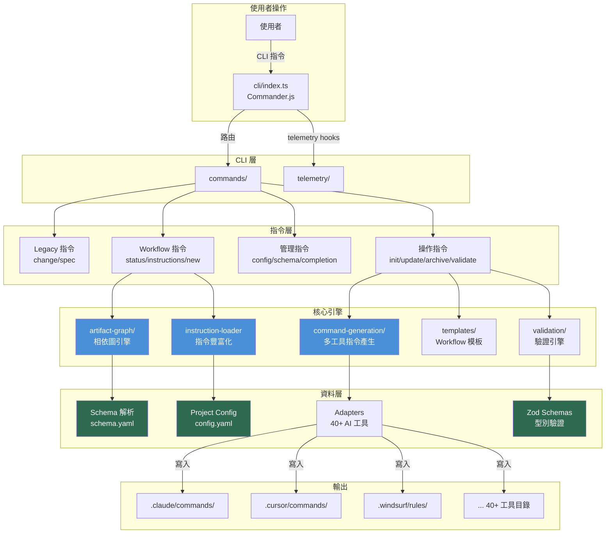

### 3.2 初始化流程 (openspec init)

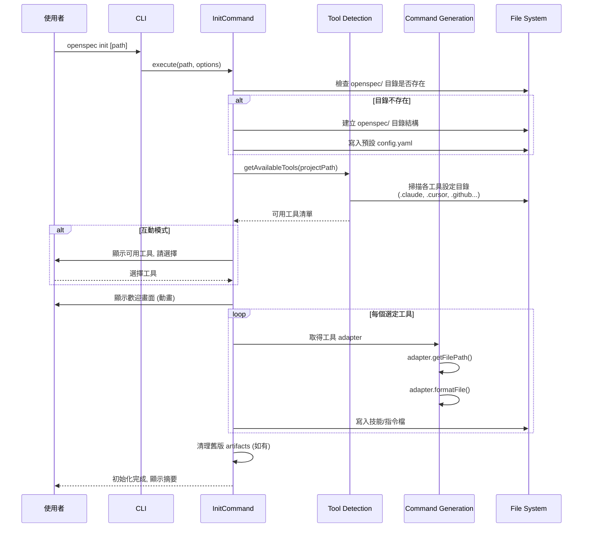

### 3.3 Artifact 驅動的開發流程

這是 OpenSpec 最核心的流程 - 以 `spec-driven` schema 為例:

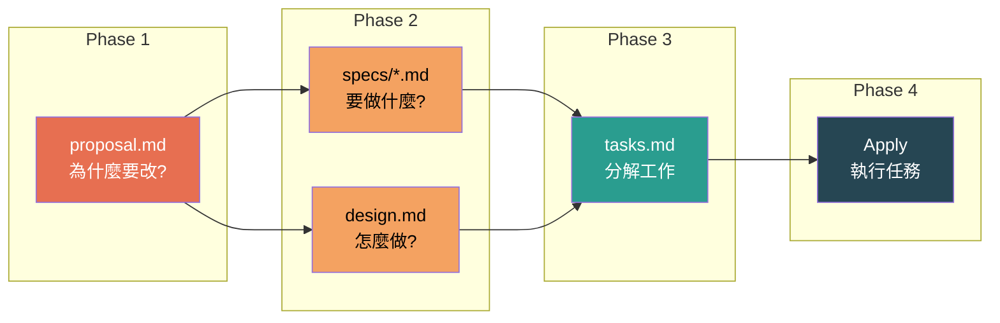

**詳細說明:**

| Phase | Artifact | 產出 | 重點 |
|-------|----------|------|------|
| 1. Proposal | `proposal.md` | 變更提案 | 說明 WHY - 為什麼需要這個改變 |
| 2. Specs | `specs/**/*.md` | 規格文件 | 定義 WHAT - 系統要做什麼 (含 SHALL/MUST 規範語句) |
| 2. Design | `design.md` | 設計文件 | 解釋 HOW - 技術方案 (選用) |
| 3. Tasks | `tasks.md` | 任務清單 | 分解 WORK - checkbox 格式的可追蹤任務 |
| 4. Apply | (程式碼變更) | 實作 | 按 tasks 逐項完成 |

### 3.4 指令豐富化流程 (Instruction Enrichment)

當使用者執行 `openspec instructions <artifact>` 時:

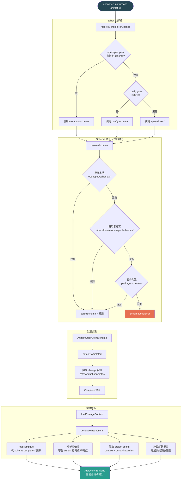

### 3.5 多工具指令產生流程

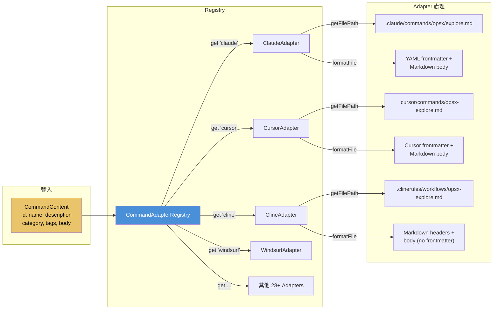

**Adapter 介面定義:**

```typescript
interface ToolCommandAdapter {
  toolId: string;                              // 工具識別碼 (e.g., 'claude')
  getFilePath(commandId: string): string;      // 產出檔案路徑
  formatFile(content: CommandContent): string; // 格式化檔案內容
}
```

### 3.6 Change 生命週期

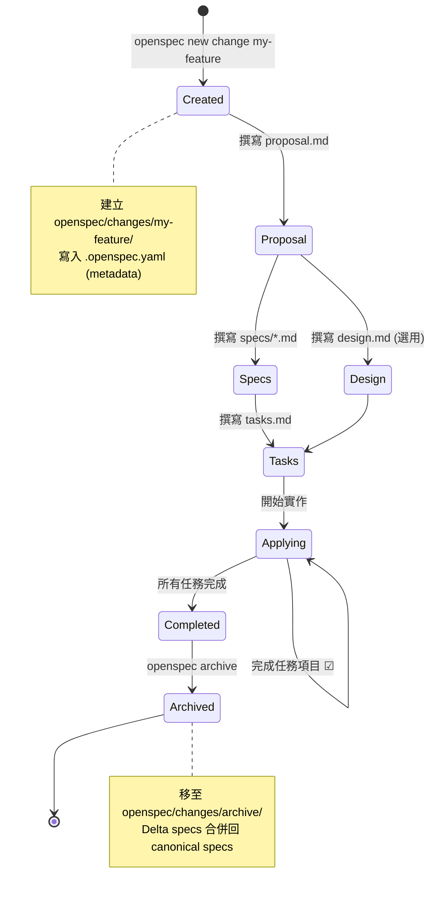

### 3.7 Schema 驗證管線

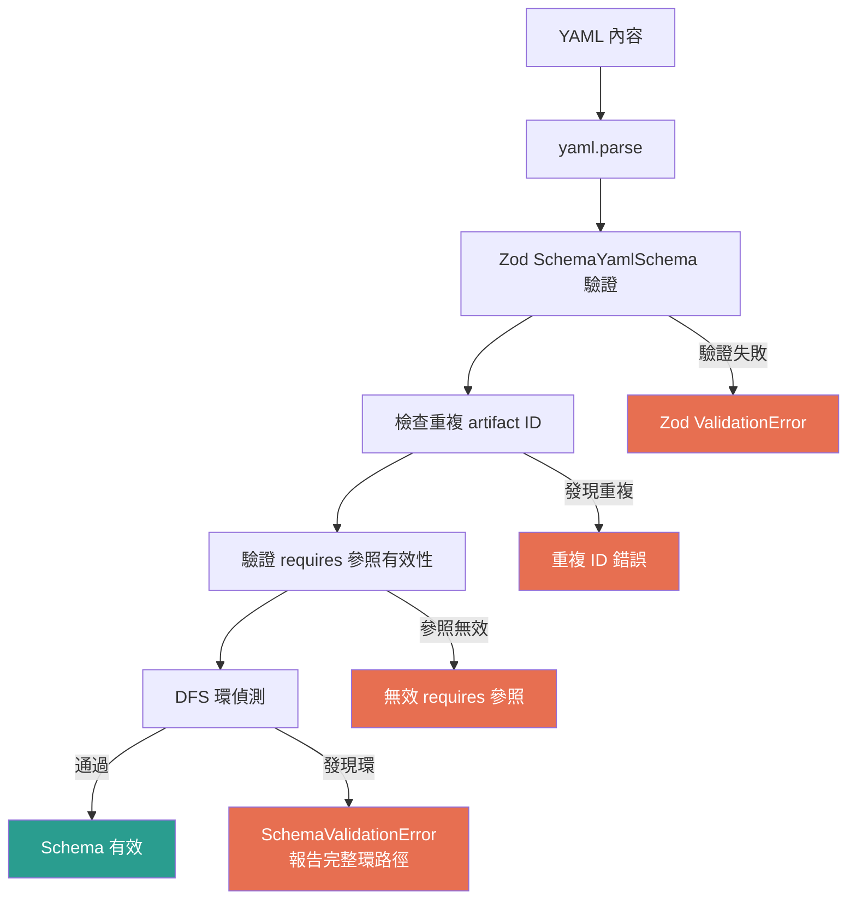

### 3.8 封存流程 (Archive)

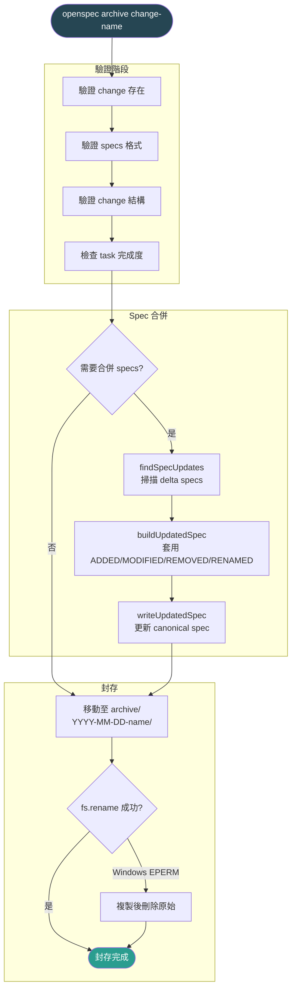

---

## 4. 功能分析

### 4.1 CLI 指令總覽

OpenSpec 的指令分為**四大類別**:

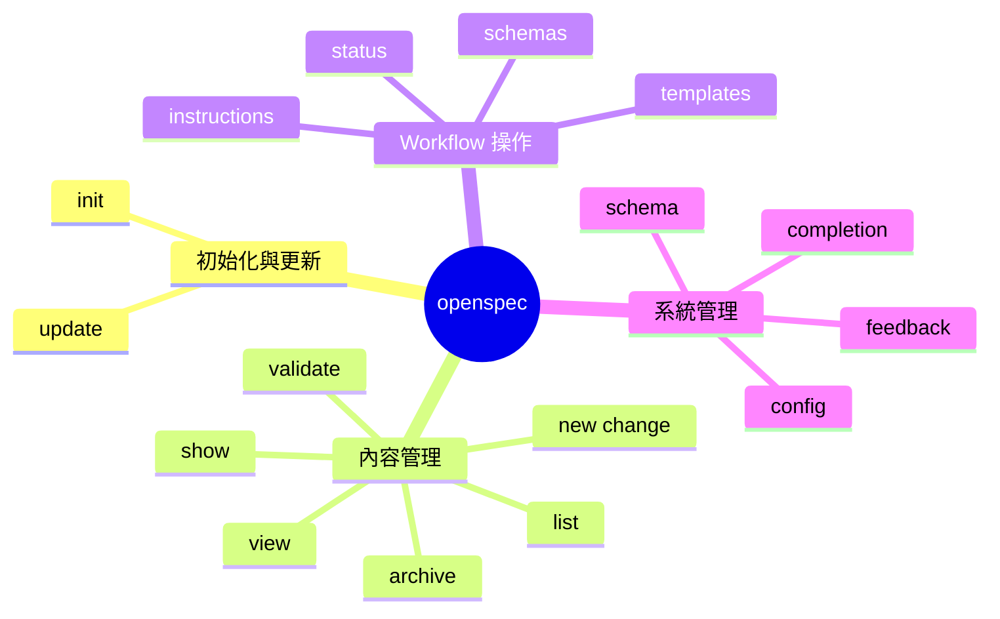

### 4.2 核心功能詳解

#### 4.2.1 初始化 (init)

| 項目 | 說明 |
|------|------|
| **目的** | 在專案中建立 OpenSpec 目錄結構, 偵測可用 AI 工具, 產生技能檔 |
| **指令** | `openspec init [path]` |
| **關鍵邏輯** | 工具偵測 → 互動選擇 → 歡迎畫面 → 技能檔產生 → 舊版清理 |
| **輸出** | `openspec/` 目錄 + 各 AI 工具的技能/指令檔 |

**工具偵測機制:** 掃描專案目錄中的工具設定資料夾 (如 `.claude/`, `.cursor/`, `.github/`), 自動標記已安裝的工具。GitHub Copilot 特別使用 `detectionPaths` 因為它的設定散佈在多處。

#### 4.2.2 Artifact Graph 引擎

這是 OpenSpec 最核心的模組, 負責管理 artifact 之間的相依關係:

| 項目 | 說明 |
|------|------|
| **目的** | 將 schema.yaml 解析為 DAG, 追蹤完成狀態, 決定下一步可做的 artifact |
| **演算法** | Kahn's algorithm (topological sort), DFS (cycle detection) |
| **核心類別** | `ArtifactGraph` |

**關鍵方法:**

```typescript
// 從 schema 建構圖
ArtifactGraph.fromSchema(schema: SchemaYaml): ArtifactGraph

// 取得建構順序 (topological sort)
getBuildOrder(): Artifact[]

// 取得目前可做的 artifact (所有相依已完成)
getNextArtifacts(completed: CompletedSet): Artifact[]

// 檢查是否全部完成
isComplete(completed: CompletedSet): boolean

// 取得被阻擋的 artifact 及其缺少的相依
getBlocked(completed: CompletedSet): BlockedArtifacts
```

**Kahn's Algorithm 運作方式:**
1. 計算每個 artifact 的 in-degree (被依賴數)
2. 將 in-degree = 0 的節點加入佇列 (排序以確保確定性)
3. 依序處理佇列中的節點, 將其相依節點的 in-degree 減 1
4. 新的 in-degree = 0 節點加入佇列
5. 重複直到佇列清空, 產出 topological order

#### 4.2.3 指令豐富化 (Instruction Enrichment)

| 項目 | 說明 |
|------|------|
| **目的** | 將原始 artifact 模板結合專案 context、rules、相依資訊, 產出完整的 AI 指令 |
| **指令** | `openspec instructions [artifact-id]` |
| **輸出** | 包含 task directive、context、rules、dependencies、template、unlocks 的完整指令 |

**豐富化的內容包含:**

| 區塊 | 來源 | 說明 |
|------|------|------|
| Task Directive | 固定模板 | 告訴 AI "你的任務是產出這個 artifact" |
| Project Context | `config.yaml` 的 `context` 欄位 | 專案技術棧、慣例等背景資訊 |
| Rules | `config.yaml` 的 `rules[artifactId]` | 針對特定 artifact 的額外約束 |
| Dependencies | artifact-graph 計算 | 列出已完成/待完成的相依 artifact 及其路徑 |
| Template | `schemas/<name>/templates/` | 該 artifact 的 Markdown 結構模板 |
| Instruction | schema.yaml 中 artifact 的 `instruction` 欄位 | 額外的指導文字 |
| Unlocks | artifact-graph 反向推算 | 完成此 artifact 後能解鎖什麼 |

#### 4.2.4 多工具 Adapter 系統

| 項目 | 說明 |
|------|------|
| **目的** | 將同一份 CommandContent 轉換為各 AI 工具專屬的格式 |
| **模式** | Adapter pattern + Static registry |
| **支援工具** | 40+ (Claude, Cursor, Cline, Windsurf, Copilot, Amazon Q, Gemini...) |

**新增工具的步驟:**
1. 在 `adapters/` 建立新檔案 (如 `my-tool.ts`)
2. 實作 `ToolCommandAdapter` 介面
3. 在 `registry.ts` 註冊
4. 在 `config.ts` 的 `AI_TOOLS` 加入工具資訊

**各工具的差異主要在:**
- 檔案路徑慣例 (如 `.claude/commands/` vs `.cursor/commands/`)
- Frontmatter 格式 (YAML vs Markdown headers vs 無)
- 命名慣例 (如 `opsx/<id>.md` vs `opsx-<id>.md`)

#### 4.2.5 Schema 管理

| 項目 | 說明 |
|------|------|
| **目的** | 管理 workflow schema 的解析、驗證、分支 (fork)、建立 |
| **指令** | `openspec schema which/validate/fork/init` |
| **三層優先** | 專案本地 > 使用者覆寫 > 套件內建 |

**Schema 結構 (schema.yaml):**

```yaml
name: spec-driven        # Schema 名稱
version: 1               # 版本號
description: "..."       # 描述

artifacts:               # Artifact 定義陣列
  - id: proposal         # 唯一識別碼
    generates: proposal.md  # 產出檔案 (支援 glob)
    description: "..."   # 人類可讀描述
    template: proposal.md   # 模板檔名
    requires: []         # 相依的 artifact ID

  - id: specs
    generates: "specs/**/*.md"
    requires: [proposal]  # 需要 proposal 先完成
    # ...

apply:                   # Apply 階段設定
  requires: [tasks]      # 需要 tasks 完成才能 apply
  tracks: tasks.md       # 追蹤的 checkbox 檔案
```

#### 4.2.6 Spec 驗證與 Delta 系統

| 項目 | 說明 |
|------|------|
| **目的** | 驗證 spec/change 結構正確性, 管理增量變更 (delta) |
| **Delta 類型** | ADDED, MODIFIED, REMOVED, RENAMED |
| **驗證規則** | SHALL/MUST 關鍵字、最少 1 個 scenario、purpose 長度限制... |

**Delta Spec 運作概念:**

```
原始 Spec (specs/auth/spec.md)        Change 中的 Delta (specs/auth/spec.md)
┌──────────────────────┐              ┌──────────────────────────────┐
│ ### Requirement: login│              │ ## MODIFIED Requirements     │
│ 使用者可以登入...     │     →        │ ### Requirement: login       │
│ #### Scenario: happy  │    封存時     │ 新增 MFA 支援...             │
│ WHEN... THEN...       │    合併       │ #### Scenario: mfa-login     │
└──────────────────────┘              │ WHEN... THEN...              │
                                      │                              │
                                      │ ## ADDED Requirements        │
                                      │ ### Requirement: mfa-setup   │
                                      │ ...                          │
                                      └──────────────────────────────┘
```

#### 4.2.7 設定系統

**三層設定架構:**

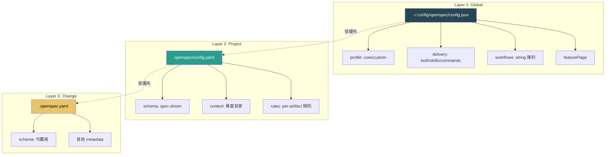

#### 4.2.8 Workflow 模板系統

OpenSpec 內建 **12 個 workflow 模板**, 每個模板都定義了完整的操作指引:

| Workflow | 用途 | 關鍵特性 |
|----------|------|----------|
| **explore** | 探索問題, 釐清需求 | 思考模式, 不直接寫程式 |
| **propose** | 建立變更提案 | 定義 WHY 與影響範圍 |
| **new-change** | 啟動 artifact 驅動的 change | 建立目錄結構與 metadata |
| **continue-change** | 繼續未完成的 change | 偵測進度, 接續下一個 artifact |
| **apply-change** | 執行 tasks, 寫入程式碼 | 追蹤 checkbox 進度 |
| **ff-change** | Fast-forward 分支 | 同步分支至 main |
| **sync-specs** | 同步 specs | 確保分支與 main 的 spec 一致 |
| **archive-change** | 封存單一 change | 合併 delta specs 回 canonical |
| **bulk-archive-change** | 批次封存 | 一次處理多個已完成 change |
| **verify-change** | 合併前驗證 | 檢查完整性與品質 |
| **onboard** | 新成員入門 | 導覽專案結構與 workflow |
| **feedback** | 收集回饋 | 結構化的回饋收集 |

每個模板同時產生 **SkillTemplate** (完整指引, 含 license/compatibility) 和 **CommandTemplate** (精簡版, 用於指令 UI)。

#### 4.2.9 Shell 自動完成

| 項目 | 說明 |
|------|------|
| **支援 Shell** | bash, zsh, fish, powershell |
| **功能** | 指令名稱、change 名稱、spec 名稱的 tab 完成 |
| **架構** | Generator (產生腳本) + Installer (安裝到 shell 設定) + Template (腳本模板) |

#### 4.2.10 遙測系統

| 項目 | 說明 |
|------|------|
| **後端** | PostHog (透過 `edge.openspec.dev` reverse proxy) |
| **追蹤內容** | 僅指令名稱 + 版本 (不含任何檔案路徑或內容) |
| **隱私設計** | 匿名 UUID、CI 環境自動停用、可完全關閉 |
| **關閉方式** | `OPENSPEC_TELEMETRY=0` 或 `DO_NOT_TRACK=1` 或 `openspec config set telemetry false` |

### 4.3 設計模式總結

| 模式 | 使用位置 | 說明 |
|------|----------|------|
| **Adapter Pattern** | command-generation | 統一介面, 各工具各自實作格式化邏輯 |
| **Factory Pattern** | ArtifactGraph.fromXxx() | 多種建構方式的靜態工廠 |
| **Registry Pattern** | CommandAdapterRegistry | 靜態註冊, 依 toolId 查找 adapter |
| **Resolution Chain** | Schema/Config 解析 | 多層 fallback (project → user → package) |
| **Barrel Export** | 各 index.ts | 統一匯出入口, 簡化 import 路徑 |
| **Zod Validation** | 所有資料模型 | Parse-time 型別驗證, 取代 runtime 手動檢查 |
| **Marker-Based Update** | FileSystemUtils | 使用 HTML 註解標記安全更新檔案區塊 |
| **Resilient Parsing** | project-config.ts | safeParse 逐欄位處理, 部分無效不影響整體 |

### 4.4 資料流總覽

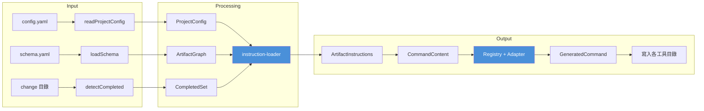

---

## 附錄: 預設 Schema (spec-driven) Artifact 相依圖

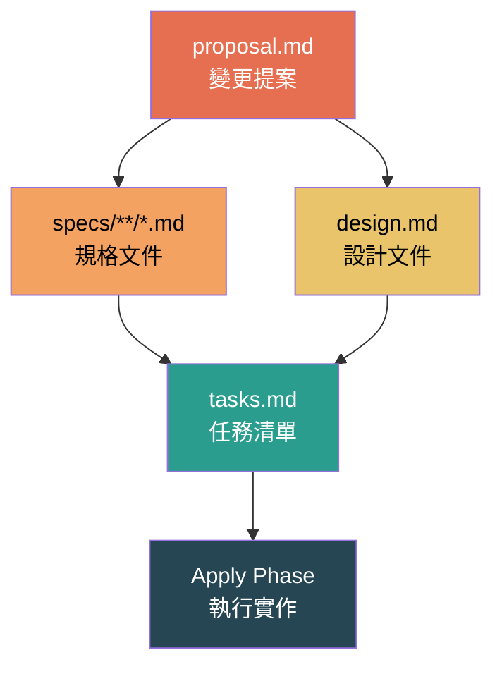

**圖例:**
- 箭頭方向表示 "需要先完成" 的關係
- proposal 是根節點 (無相依)
- specs 和 design 都依賴 proposal
- tasks 依賴 specs 和 design
- apply 依賴 tasks, 並追蹤 `tasks.md` 中的 checkbox 進度
